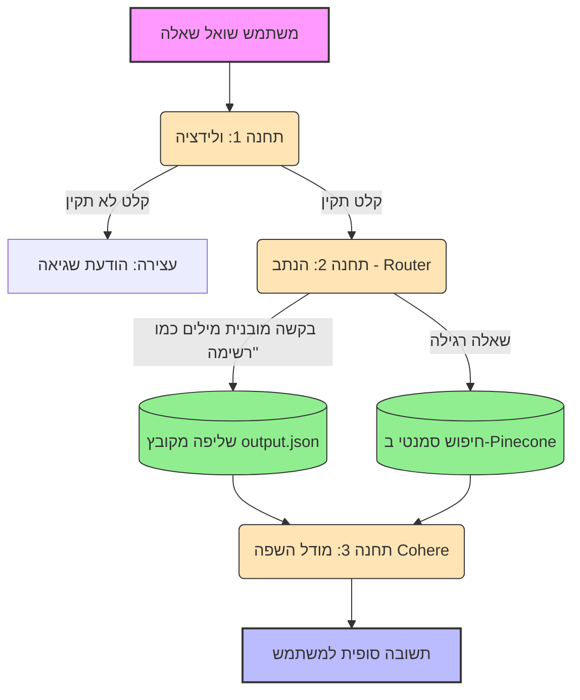

# 🧠 Agentic Docs RAG: Event-Driven Knowledge Router

ברוכים הבאים לפרויקט **Agentic Docs RAG**! 🚀
מערכת זו פותרת את ה"כאוס התיעודי" שנוצר בעבודה עם כלי AI שונים (כמו Cursor ו-Claude Code). במקום לחפש מידע בקבצי Markdown מפוזרים, המערכת מאגדת את הכל לשכבת ידע אחת חכמה. 

הייחודיות של הפרויקט טמונה בארכיטקטורת ה-**Event-Driven Workflow** שלו, הכוללת נתב (Router) שמסוגל להבחין בין שאלות הדורשות חיפוש סמנטי (מתוך מסד נתונים וקטורי) לבין שאלות הדורשות שליפת מידע מובנה ומדויק (מתוך קובץ JSON שחולץ מראש).

---

## 📊 תרשים זרימה (Workflow)

כך המערכת מטפלת בבקשות בצורה מנותבת וחכמה, מתחנת הולידציה ועד להרכבת התשובה הסופית:



---

## ✨ יכולות מרכזיות (Features)

* **ארכיטקטורה מבוססת אירועים (Stateless Workflow):** שימוש ב-LlamaIndex Workflows להעברת נתונים נקייה בין תחנות (`Validation` -> `Retrieval` -> `Generation`) ללא תלות במשתנים גלובליים, מה שמבטיח יציבות ומונע התנגשויות מידע.
* **נתב חכם (Smart Router):** המערכת מנתחת את השאילתה ומנתבת אותה:
  * *נתיב מובנה (Structured):* זיהוי שאלות רשימתיות ("תן לי רשימה", "חוקים", "החלטות") ושליפה ישירה מקובץ `output.json` שהוכן מראש.
  * *נתיב סמנטי (Semantic):* שאלות פתוחות מנותבות לחיפוש וקטורי ממוקד ב-Pinecone (שולף את התוצאה הרלוונטית ביותר - `top_k=1` לחיסכון במשאבים).
* **חילוץ נתונים מובנים (Data Extraction):** סקריפט ייעודי המשתמש ב-Pydantic ומודלי שפה כדי לקרוא את קבצי התיעוד ולחלץ מתוכם אובייקטים מוגדרים מראש (החלטות טכניות וחוקי קוד).
* **מנגנון Anti-Hallucination קשיח:** הטמעת Guardrails ברמת ה-Prompt המחייבים את מודל השפה לענות *אך ורק* על בסיס המידע שאוחזר, או להודות בחוסר ידע בצורה מפורשת.
* **ולידציית קלט (Validation Step):** חסימת שאילתות סרק או קצרות מדי (פחות מ-3 תווים) כבר בתחנה הראשונה, לחיסכון בקריאות מיותרות ל-API.
* **תאימות רשתות מסוננות (NetFree Ready):** הקוד כולל התאמות מובנות ומעקפי תעודות SSL כדי לאפשר ריצה חלקה גם מאחורי חומות אש ורשתות סינון מחמירות.

---

## 🛠️ סטאק טכנולוגי

| טכנולוגיה | תפקיד במערכת |
| :--- | :--- |
| **LlamaIndex** | ניהול ה-Workflows, בניית ה-Events, יצירת האינדקסים והפעלת ה-Retriever. |
| **Cohere** | מודל השפה (`command-r-08-2024`) ליצירת התשובות ומודל ה-Embeddings (`embed-multilingual-v3.0`). |
| **Pinecone** | מסד הנתונים הוקטורי (VectorDB) לאחסון ושליפה מהירה של המידע הסמנטי. |
| **Pydantic** | יצירת סכמות נתונים קשיחות (`Decision`, `Rule`) לטובת שלב חילוץ המידע. |
| **Gradio** | ממשק המשתמש (UI) המאפשר תקשורת אסינכרונית חלקה מול ה-Workflow. |

---

## 📁 מבנה הפרויקט

```text
RAG_PROJECT/
├── claude_code_docs/        # מסמכי תיעוד שנוצרו על ידי Claude Code
├── cursor_docs/             # מסמכי תיעוד שנוצרו על ידי Cursor
├── extract_data.py          # סקריפט לחילוץ חוקים והחלטות ויצירת קובץ ה-JSON
├── output.json              # מאגר הנתונים המובנה (נוצר אוטומטית)
├── upload_to_pinecone.py    # סקריפט האינדוקס והעלאת הוקטורים ל-Pinecone
├── workflow_chat.py         # הליבה של המערכת: Workflow, Router וממשק Gradio
├── workflow.html            # תרשים זרימה ויזואלי של ה-Workflow
├── Reflection.md            # מסקנות, תובנות ורפלקציה על תהליך הפיתוח
└── .env                     # משתני סביבה (מפתחות API)
```

---

## 🚀 הוראות התקנה והרצה

**1. התקנת תלויות (Dependencies):**
```bash
pip install llama-index llama-index-llms-cohere llama-index-embeddings-cohere llama-index-vector-stores-pinecone pinecone-client gradio python-dotenv pydantic llama-index-utils-workflow
```

**2. הגדרת סביבה:**
צרו קובץ `.env` בתיקייה הראשית והזינו את המפתחות:
```env
COHERE_API_KEY=your_key_here
PINECONE_API_KEY=your_key_here
```

**3. שלב הכנת הנתונים המובנים (Extraction):**
לפני הפעלת הצ'אט, יש להריץ את סקריפט החילוץ כדי לייצר את קובץ ה-`output.json`:
```powershell
$env:PYTHONHTTPSVERIFY=0; python extract_data.py
```

**4. הפעלת המערכת וממשק הצ'אט:**
הריצו את ה-Workflow הכולל את הנתב וממשק ה-Gradio:
```powershell
$env:PYTHONHTTPSVERIFY=0; python workflow_chat.py
```
*(המערכת תספק קישור מקומי בדפדפן)*

---

## 🙋‍♀️ דוגמאות לשאילתות (איך לבדוק את המערכת?)

* **נתיב ה-JSON (שליפה מובנית):** *"תן לי רשימה של כל החוקים וההחלטות בפרויקט."* (הנתב יזהה את המילים וישלוף את הנתונים המדויקים).
* **נתיב ה-Pinecone (חיפוש סמנטי):** *"איזה מסד נתונים נבחר לפרויקט?"* או *"מה ההנחיה לגבי תצוגת RTL?"*
* **בדיקת הגנות (Guardrails):** * הקלידו רק את האות `"א"` - ה-Workflow יעצור בתחנת הולידציה.
  * שאלו *"מה מזג האוויר?"* - המודל יענה בדיוק מופתי שלא נמצא מידע במסמכי הפרויקט.

---
*פותח מתוך אהבה לארכיטקטורה נקייה, והרצון להפוך את התיעוד הסטטי של אתמול - לסוכן ידע חכם ודינמי של מחר. 💡*
