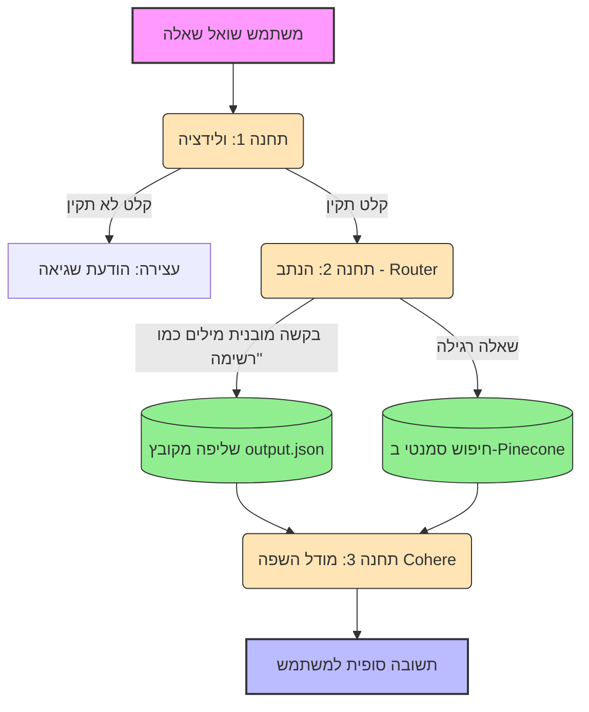

# 📊 RAG Agentic Coding Docs - Project

פרויקט זה בונה מערכת **RAG (Retrieval-Augmented Generation)** חכמה המאפשרת למפתחים לתשאל את מסמכי התיעוד של כלי קידוד אוטונומיים (כמו Cursor ו-Claude Code).

המערכת סורקת קבצי `.md`, מאנדקסת אותם ומאפשרת לשאול שאלות על החלטות עיצוב, חוקי קוד ומפרטים טכניים שנשמרו לאורך תהליך הפיתוח. בנוסף, המערכת כוללת ארכיטקטורת **Event-Driven Workflow** ונתב (Router) חכם המבדיל בין חיפוש סמנטי לחילוץ נתונים מובנים.

## 🛠️ טכנולוגיות בשימוש
* **LlamaIndex**: Framework לניהול שכבת הידע וה-RAG, כולל שימוש במנגנון ה-Workflows ליצירת תהליך מבוסס-אירועים (Event-Driven).
* **Cohere**: שימוש במודלי Embedding ותרגום סמנטי של הטקסט, וכן מודל שפה (`command-r-08-2024`) לניסוח התשובות.
* **Pinecone**: מסד נתונים וקטורי לשמירה ושליפה מהירה של המידע.
* **Gradio**: ממשק משתמש אינטראקטיבי לצ'אט.
* **Pydantic**: הגדרת מבני נתונים (Schemas) לחילוץ חוקים והחלטות לקובץ JSON מובנה.

## 📁 מבנה התיקיות שנסרקו
המערכת מאגדת ידע מהכלים הבאים:
1. **Cursor**: תיעוד מתוך תיקיית `cursor_docs` (קבצי `spec.md`).
2. **Claude Code**: תיעוד מתוך תיקיית `claude_code_docs` (קבצי `rules.md`).

## 🚀 איך להריץ את הפרויקט?

**1. התקנת ספריות:**
```bash
pip install llama-index llama-index-llms-cohere llama-index-embeddings-cohere llama-index-vector-stores-pinecone pinecone-client gradio python-dotenv pydantic llama-index-utils-workflow
```

**2. הגדרת מפתחות:**
יש ליצור קובץ `.env` בתיקיית הפרויקט ולהזין את המפתחות של COHERE_API_KEY ו-PINECONE_API_KEY:
```env
COHERE_API_KEY=your_key_here
PINECONE_API_KEY=your_key_here
```

**3. שלב ג' - חילוץ נתונים מובנים ל-JSON:**
סריקת המסמכים, חילוץ החוקים וההחלטות, ושמירתם בקובץ `output.json`.
*(הערה: הפקודה כוללת מעקף אימות SSL לטובת סביבות מסוננות כמו נטפרי)*:
```powershell
$env:PYTHONHTTPSVERIFY=0; py extract_data.py
```

**4. שלבים ב' ו-ג' - הפעלת ה-Workflow וממשק הצ'אט:**
הרצת המערכת הכוללת את הנתב החכם (שמחליט אם לשלוף מ-Pinecone או מה-JSON) ואת ממשק ה-Gradio:
```powershell
$env:PYTHONHTTPSVERIFY=0; py workflow_chat.py
```

## 📊 תרשים זרימה (Flowchart)
המערכת בנויה בארכיטקטורת Event-Driven. הנה זרימת הנתונים מתחנת הולידציה, דרך הנתב (Router), ועד ליצירת התשובה:



## 🙋‍♀️ דוגמאות לשאלות שהמערכת יודעת לענות עליהן
* **חיפוש סמנטי (מ-Pinecone):** "איזה מסד נתונים (DB) נבחר לפרויקט?"
* **חיפוש סמנטי (מ-Pinecone):** "מה ההנחיה לגבי תצוגת RTL?"
* **חילוץ מובנה (מה-JSON דרך הנתב):** "תן לי רשימה של כל החוקים וההחלטות בפרויקט."
* **הגנות וולידציה:** הזנת קלט חלקי (כמו האות "מ") תעצור את ה-Workflow בתחנה הראשונה, ושאלות לא קשורות ("מה מזג האוויר?") ייענו בהודעה שהמידע לא נמצא במסמכים.